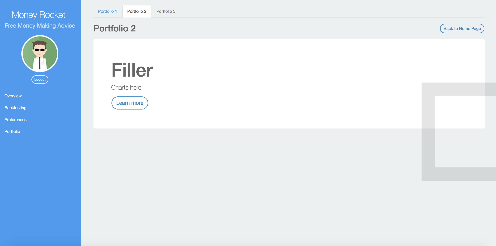

## MSF Capstone Project

This is my repo to play around with the front-end of my Capstone design project. There needs to be a user friendly UI which people can use to view portfolios and play around with several financial models. This template is currently based on: http://startangular.com/product/ani-theme/. Core Technologies: NodeJS, React, Bootstrap.

## Installation

1. Make sure you have [npm](https://www.npmjs.org/) installed globally.

2. On the command prompt navigate to the directory where you want the project folder. For example:

```sh
$ cd Documents
```
3. Clone the repo, i.e.
```sh
$ git clone https://github.com/linglong97/MSF-Capstone-Project.git
```
4. Navigate to the rep, i.e.
```sh
$ cd MSF-Capstone-Project
```
5. Install dependencies from the Package.json file, then start the project.
```sh
npm install
```
```sh
npm start
```
In any web browser(Google Chrome preferred), navigate to 
```sh
http://localhost:8080
```
to view the webpack compiled code.

### Automation tools used
- [Webpack](https://webpack.github.io/)

### Preview

